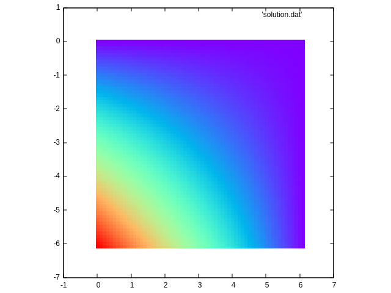

# MIDTERM EVALUATION
## Background

Please refer to [background.md](./aux/background.md)

## Makefile
- `make` to compile
- `make run` to compile and run
- `make plot` to see the solution using *gnuplot*
- `make clean` to clean up

## Exercises
1. Parallelize and optimize `jacobi.c` following
   [**these assignments**](./aux/hints.md)

2. Perform a performance analysis of the code scaling, provide
   scalability charts and a brief explanation (matrix size 1200 and
   12000, 10 iterations)

## Reference result (matrix size 60, 2000 iterations)
### Initial distribution of temperature
	
### Final distribution of temperature (after 2000 iterations)

